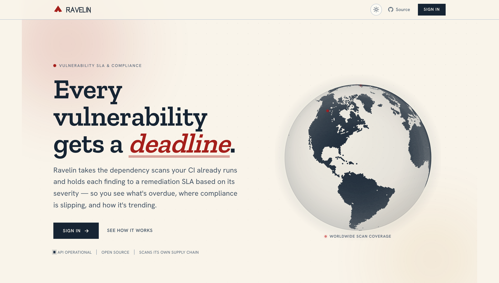

<p align="center">
  
</p>

<h1 align="center">Ravelin</h1>

<p align="center"><b>Vendor-neutral vulnerability SLA &amp; compliance tracker.</b></p>

<p align="center">
  <a href="https://github.com/asharahmed/ravelin/actions/workflows/security.yml"></a>
  <a href="https://dotnet.microsoft.com/"></a>
  <a href="https://learn.microsoft.com/aspnet/core/blazor/"></a>
  <a href="https://azure.microsoft.com/products/container-apps"></a>
  <a href="./infra"></a>
  <a href="./LICENSE"></a>
</p>

Ravelin tracks remediation SLAs for the dependency vulnerabilities your scanners already find.
CI pushes scan results to its API; Ravelin gives each finding a deadline based on severity,
flags the ones that miss it, tracks the trend over time, and exports an audit report. It's
vendor-neutral, API-first, and self-hosted.

> A *ravelin* is a triangular outwork built in front of a fortress wall. The logo is its salient.

**Live demo:** <https://getravelin.xyz> · interactive API reference at
<https://getravelin.xyz/scalar>. Sign up from the login page for a read-only **Viewer** account
to explore the dashboards, reports, and API — there are no shared credentials to hand out. It
runs on scale-to-zero infrastructure, so the first request after an idle period takes a few
seconds to wake.



---

## What it does

Scanners like Dependabot, Snyk, and Trivy report vulnerabilities. They don't track whether those
vulnerabilities get fixed on time, or give you one view across all of them. Ravelin is that layer:

- Ingests findings from any scanner through a single API.
- Assigns each finding a remediation deadline based on its severity, and marks it breached once
  the deadline passes.
- Reports compliance percentage, breaches by project and severity, and an opened-vs-resolved trend.
- Requires a written justification to mark a finding a false positive or accepted risk, and keeps
  it on the record.

It does not scan code itself, and it is not a GRC platform.

## How it compares

| | Scanners (Dependabot, Snyk, Trivy) | GRC suites (Vanta, Drata) | Ravelin |
|---|:---:|:---:|:---:|
| Vendor-neutral across scanners | — | partial | yes |
| Severity-based remediation SLAs + breach tracking | partial | partial | yes |
| Security-posture trend over time | partial | partial | yes |
| Audit-ready remediation evidence | — | yes | yes |
| Full GRC (policies, access reviews, vendor risk) | — | yes | — |
| Self-hostable & open source | varies | — | yes |
| Lightweight, no per-seat pricing | yes | — | yes |

Scanners report findings but don't enforce remediation timelines across tools. GRC suites
automate audits company-wide, but they're broad, SaaS-only, and priced for it — vulnerability
SLAs are a small part of a large platform. Ravelin does only the vulnerability-SLA layer:
vendor-neutral, self-hosted, and free. If you need continuous evidence across every control, use
a GRC suite and let Ravelin own the vulnerability slice.

## How it works

1. A pipeline step POSTs scan results to `/api/ingest` with a scoped, hashed API key. Ravelin
   deduplicates against previous scans and auto-resolves findings that are no longer present.
2. Each finding takes a deadline from its severity — Critical 7d, High 30d, Medium 90d, Low 180d
   by default — measured from when it was first seen. It's breached once it passes the deadline.
3. Dashboards show compliance, breaches, and the trend. Analysts triage findings; suppressing one
   requires a justification.

A scan push is one request:

```bash
curl -X POST https://<host>/api/ingest \
  -H "X-Api-Key: <project-api-key>" \
  -H "Content-Type: application/json" \
  -d '{
    "tool": "trivy",
    "toolVersion": "0.50.0",
    "findings": [
      {
        "vulnerabilityId": "CVE-2024-21907",
        "packageName": "Newtonsoft.Json",
        "packageVersion": "12.0.1",
        "title": "Improper handling of exceptional conditions",
        "severity": "High",
        "cvssScore": 7.5,
        "fixedVersion": "13.0.1"
      }
    ]
  }'
# -> { "scanId": "...", "created": 1, "reopened": 0, "resolved": 0, "seen": 0, "openTotal": 1 }
```

Or pipe a scanner's native output straight in — Ravelin maps Trivy, Grype, and `dotnet list
package` JSON itself, no transform step:

```bash
trivy fs --format json . | curl -sf -X POST https://<host>/api/ingest/trivy \
  -H "X-Api-Key: $RAVELIN_API_KEY" --data-binary @-

grype dir:. -o json     | curl -sf -X POST https://<host>/api/ingest/grype \
  -H "X-Api-Key: $RAVELIN_API_KEY" --data-binary @-

dotnet list package --vulnerable --include-transitive --format json \
  | curl -sf -X POST https://<host>/api/ingest/dotnet \
    -H "X-Api-Key: $RAVELIN_API_KEY" --data-binary @-
```

Ravelin is built to **eat its own dog food**: its CI (`.github/workflows/security.yml`) can push
the app's own `dotnet list package --vulnerable` results to the live instance through that last
endpoint, so the demo tracks Ravelin's own dependency-remediation SLAs. The push step is gated on
a configured `RAVELIN_INGEST_KEY` secret and is a no-op until that key is wired up.

## What's inside

Beyond ingestion and SLA tracking, the app ships:

- **Risk-based prioritization** — findings are enriched with **CISA KEV** (known actively exploited)
  and **FIRST EPSS** (predicted exploitation probability). An actively-exploited or high-EPSS
  finding gets a **tighter, risk-adjusted SLA** than its CVSS severity alone would set, and lists
  sort by real risk (KEV first). Severity is a weak triage signal on its own; this prioritizes by
  exploitation in the wild. Uses only public feeds; enabled with `VulnIntel__Enabled=true`.
- **SLA alerting** — an hourly re-evaluation raises breach / due-soon alerts and dispatches them
  to a per-project **Slack or generic webhook** (SSRF-validated). Alerts are acknowledgeable, with
  an unacknowledged count in the nav. On scale-to-zero infra the hourly pass is driven by a tiny
  Container Apps cron job so no always-on replica is needed.
- **Audit trail** — an append-only log of security-relevant actions (logins, role changes, key
  create/revoke, triage, SLA edits, webhook config…), viewable by admins.
- **Error capture** — unhandled exceptions are recorded as deduplicated, secret-scrubbed
  `AppError`s and can be filed as **Linear** issues when a tracker is configured.
- **Admin console** — self-service signup (read-only Viewer), user & role management, admin
  password reset, project archive/unarchive, and API-key list/revoke.
- **Published API** — the OpenAPI document at `/openapi/v1.json` with an interactive **Scalar**
  reference at `/scalar`.
- **Point-in-time compliance report** — a print/PDF-friendly breach report.

See [`docs/architecture.md`](./docs/architecture.md) for how these fit together and
[`docs/THREAT-MODEL.md`](./docs/THREAT-MODEL.md) for the STRIDE analysis.

## Authentication

- **People** — ASP.NET Core Identity with JWTs and three roles: Admin, Analyst, Viewer, enforced
  per endpoint. Self-service signup creates a read-only Viewer; Analyst and Admin are assigned by
  an Admin.
- **Pipelines** — scoped API keys, stored hashed (SHA-256, 256-bit). A key is bound to one
  project, and the scope of an ingested scan comes from the key, not the request route.

## Architecture

| Layer | Choice |
|-------|--------|
| Language | C# / .NET 10 |
| UI | Blazor WebAssembly, served by the API host (one deployable unit) |
| API | ASP.NET Core minimal API, OpenAPI published |
| Data | EF Core → SQL Server / Azure SQL (serverless) |
| Auth | ASP.NET Core Identity + JWT (RBAC); hashed, scoped API keys for pipelines |
| Packaging | Docker — chiseled, non-root runtime image |
| Hosting | Azure Container Apps (scale-to-zero) + Azure Container Registry |
| CI/CD | Azure Pipelines |
| IaC | Terraform (remote state in Azure Storage) |

The OpenAPI document is served at `/openapi/v1.json`, with an interactive API reference at
`/scalar`. A full walkthrough with diagrams is in [`docs/architecture.md`](./docs/architecture.md).

The solution keeps the domain free of infrastructure dependencies:

```
src/
  Ravelin/                ASP.NET Core host — Web API + serves the Blazor client
  Ravelin.Client/         Blazor WebAssembly UI
  Ravelin.Domain/         Entities + pure business logic (reconciliation, SLA engine, triage)
  Ravelin.Infrastructure/ EF Core, persistence, API-key + ingestion services
  Ravelin.Shared/         DTOs / contracts shared by API and client
tests/
  Ravelin.Tests/          xUnit tests (reconciler, SLA evaluation, triage, CSV)
infra/terraform/          Azure infrastructure
```

## Running locally

### Quickstart (Docker Compose)

The fastest path — brings up the app **and** SQL Server, migrated and demo-seeded, in one command.
Requires only Docker.

```bash
git clone https://github.com/asharahmed/ravelin.git
cd ravelin
cp .env.example .env        # then edit the secrets in .env
docker compose up --build
```

Open <http://localhost:8080> and sign in with the seeded admin/demo accounts from your `.env`.
The app applies EF migrations on boot and seeds demo projects, so the dashboard shows a real
posture right away. `docker compose down -v` tears it down (and removes the SQL volume).

### From the .NET SDK

Requires the [.NET 10 SDK](https://dotnet.microsoft.com/download), Docker (for SQL Server), and
the EF Core tools (`dotnet tool install --global dotnet-ef`).

```bash
git clone https://github.com/asharahmed/ravelin.git
cd ravelin

# 1. SQL Server (dev matches prod)
docker run -d --name ravelin-sql -p 1433:1433 \
  -e "ACCEPT_EULA=Y" -e "MSSQL_SA_PASSWORD=Your_strong_Pass123" \
  mcr.microsoft.com/mssql/server:2022-latest

export RAVELIN_DB_CONNECTION="Server=localhost,1433;Database=ravelin;User Id=sa;Password=Your_strong_Pass123;TrustServerCertificate=true"

# 2. Apply migrations
dotnet ef database update \
  --project src/Ravelin.Infrastructure --startup-project src/Ravelin.Infrastructure

# 3. Run (UI + API on the printed URL)
export ConnectionStrings__RavelinDb="$RAVELIN_DB_CONNECTION"
export Jwt__SigningKey="dev-signing-key-at-least-32-characters-long"
export Seed__AdminEmail="admin@ravelin.local" Seed__AdminPassword="Admin_pass_123!"
export Seed__DemoData="true"   # seeds demo projects + findings
dotnet run --project src/Ravelin/Ravelin.csproj
```

Sign in with the seeded admin account. Build and test the solution with:

```bash
dotnet build Ravelin.slnx
dotnet test  Ravelin.slnx
```

Infrastructure and deployment are in [`infra/README.md`](./infra/README.md).

## Security

Ravelin is a security tool, so it's built to model good practice and to scan itself:

- Scan payloads are treated as untrusted and validated at the API boundary.
- API keys are hashed; RBAC is enforced per endpoint, deny-by-default.
- A Content-Security-Policy and the standard security headers (`X-Content-Type-Options`,
  `X-Frame-Options`, `Referrer-Policy`, `Permissions-Policy`) are sent on every response.
- Auth and ingestion endpoints are rate-limited per client IP (brute-force / abuse defence).
- Application secrets (database connection, JWT signing key, seeded passwords) live in **Azure
  Key Vault** and are read at runtime via a managed identity — never inlined or logged.
- The CI pipeline scans Ravelin's own dependencies, code, container image, and IaC.

The full STRIDE threat model — assets, trust boundaries, and each threat mapped to the mitigation
in the code — is in [`docs/THREAT-MODEL.md`](./docs/THREAT-MODEL.md).

## Status

Live at <https://getravelin.xyz>. Built in reviewable stages — Stages 0–8 are shipped, plus SLA
alerting and operational hardening:

| Stage | Scope | State |
|-------|-------|-------|
| 0 | Solution, clean architecture, walking skeleton, container | Done |
| 1 | Terraform infra, Azure Container Apps, CI/CD pipeline | Done |
| 2 | Domain model, EF Core, Azure SQL | Done |
| 3 | Ingestion API, hashed keys, dedup + auto-resolve | Done |
| 4 | Identity + JWT + RBAC, login, self-service signup | Done |
| 5 | SLA engine + triage | Done |
| 6 | Dashboards | Done |
| 7 | Point-in-time compliance report (print / save as PDF) | Done |
| 8 | DevSecOps hardening — pipeline scanners (SCA/SAST/secret/image/IaC), Key Vault via managed identity | Done¹ |
| 9 | Admin console — project archive, API-key revoke/list, user & role management, password reset | Done |
| 10 | SLA alerting (webhooks/Slack + hourly re-eval), audit trail, error capture → Linear | Done |

¹ Secrets are in Key Vault via managed identity; switching **SQL** auth from the admin login to a
managed-identity least-privilege DB user is the one deliberately deferred item (see
[`docs/THREAT-MODEL.md`](./docs/THREAT-MODEL.md) §4).

Design rationale and the full decision log are in [`PROJECT_VISION.md`](./PROJECT_VISION.md). The
design system is documented in [`DESIGN.md`](./DESIGN.md) and rendered live at `/styleguide`.

## License

[MIT](./LICENSE)
