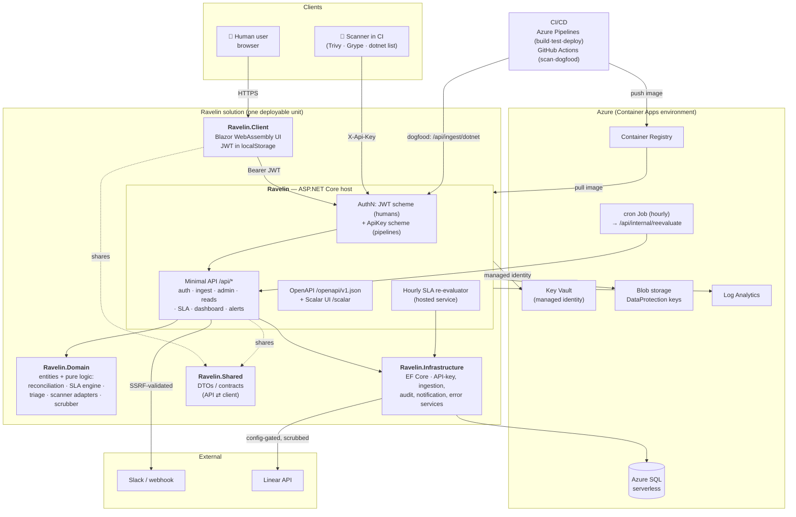

# Ravelin — Architecture

Ravelin is a vendor-neutral vulnerability SLA & compliance tracker. This document shows how the
pieces fit together: the .NET solution, the request and authentication flow, the Azure resources
it runs on, and the CI/CD pipeline that scans the app and feeds findings back into it.

For the security-focused view, see [`THREAT-MODEL.md`](./THREAT-MODEL.md).

## System diagram

## How it fits together

**One deployable unit.** The `Ravelin` host is an ASP.NET Core app that serves both the JSON API
and the compiled `Ravelin.Client` Blazor WebAssembly bundle as static assets. Shipping the UI and
API together keeps hosting cheap (a single Container App) and lets the whole thing scale to zero
when idle. The five projects follow clean-architecture layering: `Ravelin.Domain` holds entities
and pure business logic (finding reconciliation, the SLA evaluator, triage rules, the scanner
adapters, the secret scrubber) with no infrastructure dependencies; `Ravelin.Infrastructure`
holds EF Core and the services that touch the database or the network; `Ravelin.Shared` holds the
DTOs both the API and the client bind to; and `Ravelin` wires it all up and exposes the HTTP
surface. The published OpenAPI document (`/openapi/v1.json`) and its interactive Scalar reference
(`/scalar`) make the API-first contract explicit.

**Request and auth flow.** Two authentication schemes coexist. Humans authenticate with
email/password, receive an HMAC-signed JWT, and the Blazor client sends it as a bearer token on
every `/api/*` call; role claims (Admin / Analyst / Viewer) drive deny-by-default authorization
per endpoint. Pipelines authenticate with a scoped, hashed API key sent as `X-Api-Key` — the key
is bound to exactly one project, and the ingested scan's scope comes from the key, never from the
request. Both schemes pass through the same middleware chain (forwarded headers → correlation id
→ security headers/CSP → error capture → authentication → authorization → rate limiting →
antiforgery) before reaching the minimal-API handlers.

**Azure resources.** The app runs on Azure Container Apps behind managed-TLS ingress, pulling its
image from Azure Container Registry with a runtime managed identity scoped to `AcrPull`. Data
lives in a serverless Azure SQL database (EF Core migrations applied on boot). Secrets — the
database connection string, JWT signing key, and seed passwords — are stored in Azure Key Vault
and read at runtime through the app's user-assigned managed identity, never inlined into the app
definition. DataProtection keys persist to Blob storage (also via managed identity) so antiforgery
and password-reset tokens survive restarts. Structured logs flow to Log Analytics. Because the app
scales to zero, a tiny Container Apps cron Job wakes it hourly to re-evaluate SLAs and dispatch any
new breach/due-soon notifications.

**CI/CD and the dogfood loop.** Azure Pipelines builds, tests, and deploys the container image
(SDK-based container publish → ACR → Container Apps update). A separate GitHub Actions workflow
(`security.yml`) runs the security controls Ravelin itself tracks — dependency scanning (SCA),
CodeQL SAST, Trivy IaC/secret and container-image scans — and publishes SARIF to the repo's
Security tab. That same workflow can push the app's own `dotnet list package --vulnerable` results
to the live instance's `/api/ingest/dotnet` endpoint, so `getravelin.xyz` tracks Ravelin's own
dependency-remediation SLAs — the app eating its own dog food.
</content>
